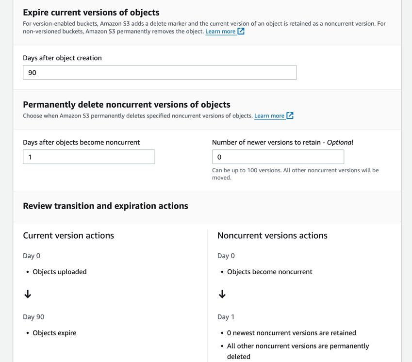

# S3-SCV-Records-Management

This repository showcases an integration for syncing transcript record deletion between AWS Amazon Connect and Salesforce Service Cloud Voice. 
The process involves placing an event trigger on a Lambda function, which, when a corresponding S3 `.wav` recording is deleted after 90 days, triggers the Lambda to make a REST callout to an Apex endpoint. 
The Apex side then handles the deletion of all ConversationEntry records related to that recording.

## Setting up Apex and API User
1. **Deploy Components to Salesforce Org:**
   - **CLI:** `sf project deploy start --target-org <sf_org>`

2. **Create a New API_Only User:**
   - `User License`: `Salesforce`
   - `Profile`: `API_ONLY`

3. **Verify User and Set Up Password:**
   - Save the username and password for later use.

4. **Assign Permissions:**
   - Assign the user the `Delete_Transcripts_REST` permission set.

## Setting up Connected App in Salesforce
1. **Navigate to Connected App Setup:**
   - `Setup` -> `App Manager` -> `New Connected App`

2. **Fill Out App Details:**
   - `App Name`, `API Name`, and `Contact Email`

3. **Enable OAuth Settings:**
   - Set Callback URL to `https://login.salesforce.com/services/oauth2/callback`
   - Add OAuth scopes: `Manager user data via APIs (api)`, `Perform requests at any time (refresh_token, offline_access)`

4. **Save Consumer Details:**
   - After initialization, click `Manage Consumer Details`:
      - Save the `Consumer Key` and `Consumer Secret` for later use.

5. **Add API_Only Profile to Connected App:**
   - After creating the connected app, navigate back to `App Manager` 
   - Navigate to the newly created app and click `Manage`
   - `Profiles` -> `Manage Profiles` 
   - Add `API_Only` and save

## Setting up Lambda
1. **Create IAM Policy:**
   - Create a new `IAM Policy` with the required permissions.
```
         {
            "Version": "2012-10-17",
            "Statement": [
                  {
                     "Effect": "Allow",
                     "Action": [
                        "logs:PutLogEvents",
                        "logs:CreateLogGroup",
                        "logs:CreateLogStream"
                     ],
                     "Resource": "arn:aws:logs:*:*:*"
                  },
                  {
                     "Effect": "Allow",
                     "Action": [
                        "s3:GetObject",
                        "s3:PutObject"
                     ],
                     "Resource": "arn:aws:s3:::*/*"
                  }
            ]
         }
```
2. **Create IAM Role:**
   - Navigate to `IAM Console` -> `Roles` -> `Create Role`
   - Select `AWS Service` and `Lambda` as the entity and use cases.
   - Add the previously created policy.
   - Create the role.

3. **Create Lambda Function:**
   - Navigate to `Lambda Console` -> `Functions` -> Create a new function in `Node.js 20.x` runtime and `x86_64` architecture.
   - Use the role created in step 2.

4. **Add S3 Trigger:**
   - Add a new trigger for S3 source, specifying object deletion events with `.wav` suffix.

5. **Deploy Function Code:**
   - Add the source code from `./aws/lambda/` and deploy the function.

6. **Add Environment Variables:**
   1. `CONSUMER_KEY`: Consumer key saved from the connected app
   2. `PRIVATE_KEY`: Consumer secret saved from the connected app
   3. `USERNAME`: Username for a user in the SF org with permissions to run the delete job
   4. `PASSWORD`: Password for a user in the SF org with permissions to run the delete job
   5. `SF_AUTH_ENDPOINT`: `https://test.salesforce.com/services/oauth2/token` for a sandbox environment, `https://login.salesforce.com/services/oauth2/token?` for a production environment
   6. `REST_API_ENDPOINT`: `<sf_org_domain>/services/apexrest/DeleteTranscript`

7. **Add Test Event:**
   - Add a test event with the provided JSON, replacing placeholders `BUCKET_NAME` and `EXAMPLE_FILE`.
```
{
  "Records": [
    {
      "eventVersion": "2.0",
      "eventSource": "aws:s3",
      "awsRegion": "us-east-1",
      "eventTime": "1970-01-01T00:00:00.000Z",
      "eventName": "ObjectRemoved:Delete",
      "userIdentity": {
        "principalId": "EXAMPLE"
      },
      "requestParameters": {
        "sourceIPAddress": "127.0.0.1"
      },
      "responseElements": {
        "x-amz-request-id": "EXAMPLE123456789",
        "x-amz-id-2": "EXAMPLE123/5678abcdefghijklambdaisawesome/mnopqrstuvwxyzABCDEFGH"
      },
      "s3": {
        "s3SchemaVersion": "1.0",
        "configurationId": "testConfigRule",
        "bucket": {
          "name": "BUCKET_NAME",
          "ownerIdentity": {
            "principalId": "EXAMPLE"
          },
          "arn": "arn:aws:s3:::BUCKET_NAME"
        },
        "object": {
          "key": "EXAMPLE_FILE.wav",
          "size": 1024,
          "eTag": "e13fd810551be669677d4c3f8558e78d",
          "sequencer": "0A1B2C3D4E5F678901"
        }
      }
    }
  ]
}
```

## Setting up Lifecycle Expiration Configuration
1. **Navigate to S3 Bucket:**
   - AWS Console -> Desired S3 Bucket

2. **Create Lifecycle Rule:**
   - Under `Management` tab -> `Lifecycle Rules` -> `Create lifecycle rule`
   - Configure rule settings, specifying the desired expiration period.
   - For Versioned Buckets, also checkmark `Permanently delete noncurrent versions of objects`
   - The following image from a versioned bucket depicts a lifecycle rule that expires objects after 90 days and permanently deletes them 1 day after expiration.
   - 

3. **Configure Event Notification:**
   - Under `Properties` tab -> `Event Notifications`, edit the event notification publishing to the Lambda function.
   - Under `Lifecycle`, checkmark `Delete marker added by Lifecycle for a versioned object`.

4. **Save Changes.**

   
